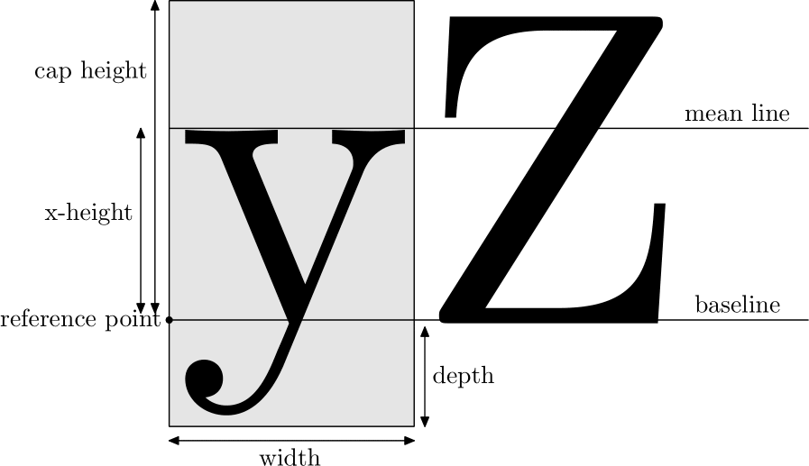

# 3. TeX/LaTeX 語法概說

這一章要談的是，和一般的純文字文稿及其他 markup 式文件系統在語言上的一般差異性。為了讓觀念上能夠更清楚，以下所述主要是要在命令列執行的，致於編輯器上方便的按鍵及巨集，這裡就不多談，一方面是每個人使用的編輯器不一樣，二方面是要先把黑盒子拿掉，整個處理流程才會有概念。

當然，由於完全還沒有開始實際寫文稿來測試，所以，這章是紙上談兵，不必動手，用看的就好。但，別急，我們會在 [第 04 章](../start) 開始實際玩看看，請別忘了，到時要再回頭來複習一下這些資料。

而且，前面已經說過，這篇文章主要是著眼於 \LaTeX 所附上的巨集，一些其他方便的套件引用，將會在最後或另文再來談。其實，不引用任何外來特殊套件，讓 \LaTeX 本身去處理，最起碼也就不會太離譜，要講求美觀、微調，個人是認為先把基礎弄起來再說，有些套件的複雜程度，會令人頭疼，你是不是真有這個需要，值得考慮。而且，很多時候自認為不錯的「微調」，其實常常會不合排版的慣例。\TeX/\LaTeX 的語法，可以是很簡單明白，也可以是相當的複雜，這是 \TeX 系統本身的彈性所導致。

## 3.1 LaTeX 文稿的處理流程

最簡單的一句話，就是把編輯器編輯好的文稿（通常結尾是 `.tex`），利用 `latex` 這個指令去編譯文稿就對了！

```bash
$ latex your.tex
```

需要注意的是，如果有索引，還要用 `makeindex` 執行一次，有參考文獻，還需要 bibtex 處理一次，最後再使用 `latex` 再處理一至二次，也就是說視文稿的複雜程度，`latex` 可能需要執行好幾次，這在往後碰到時會再提出來。另外，處理中文的話，需要其他前置處理，這裡暫時先以英文文稿來說明，中文的部份，只要加入中文環境及（或）改用能處理中文的前置處理器就可以了。

這樣經過 `latex` 處理後，會產生一個 `your.dvi` 檔，然後可以使用 `dvips` 來產生 POSTSCRIPT 格式的檔案。也可以使用 `dvipdfm[x]` 來產生 PDF 的格式，當然，也可以使用 `ps2pdf` 經由 POSTSCRIPT 格式轉換成 PDF 格式。另外，也可由 `pdflatex` 由 `your.tex` 直接編譯成 PDF 格式的輸出。

### 3.1.1 總結一下處理流程


<div align="center">
  
</div>


## 3.2 LaTeX 的特殊專用符號

在 \TeX/\LaTeX 的世界，原始文稿都是純文字檔，任何一種編輯器都可以打開來編輯、觀看。而排版指令通常是由反斜線（`\`, backslash）所開頭來引導。註解則是由百分號（`%`）來引導。例如，以編輯器編輯下列文字：

```tex
This is my first \LaTeX\ typesetting example.
```

編譯後會變成以下的結果：


\text{This is my first \LaTeX\ typesetting example.}


其中的 `\LaTeX` 就是 \LaTeX 的一個指令，會顯示 \LaTeX 這個特殊的圖示。

由於，西方國家的語系，通常字母、符號的最大容量只有 256 個（2^8），因此，許多現有的符號必須拿來當做控制指令，才能符合排版的多樣化需求。以下的符號，接觸 \TeX/\LaTeX 的朋友，可能都得時時留意，不要未經處理就直接寫進文稿裡頭去了。

通常，編輯器的語法顏色會幫助判斷語法是否正確，但不是都能完美無缺，有時還是會漏掉，這時別忘了查看一下 `*.log` 檔案，例如：編譯 `your.tex` 檔的話，他的 log 檔就是 `your.log`。

| 符號  | 作用                             |   文稿上使用   | \LaTeX 的替代指令 |
| :---: | :------------------------------- | :------------: | :------------------------------------------- |
|  `\`  | 下排版命令                       | `$\backslash$` | `\textbackslash`                             |
|  `%`  | 註解                             |      `\%`      | NA                                           |
|  `#`  | 定義巨集                         |      `\#`      | NA                                           |
|  `~`  | 產生一個空白                     |     `\~{}`     | `\textasciitilde`                            |
|  `$`  | 進入（離開）數學模式             |      `\$`      | `\textdollar`                                |
|  `_`  | 數學模式中產生下標字             |     `\_{}`     | `\textunderscore`                            |
|  `^`  | 數學模式中產生上標字             |     `\^{}`     | `\textasciicircum`                           |
|  `{`  | 標示命令的作用範圍               |      `\{`      | `\textbraceleft`                             |
|  `}`  | 標示命令的作用範圍               |      `\}`      | `\textbraceright`                            |
|  `<`  | 數學模式中的小於符號             |     `$<$`      | `\textless`                                  |
|  `>`  | 數學模式中的大於符號             |     `$>$`      | `\textgreater`                               |
|  `|`  | OT1 編碼，數學模式中才能正確顯示 |     `$|$`      | `\textbar`                                   |
|  `&`  | 表格中的分隔符號                 |      `\&`      | NA                                           |

## 3.3 LaTeX 排版上的一些規範或慣例

除了上面所談到的特殊符號外，也有一些規範或慣例要遵守，有些是比較硬性的規定，有些則只是慣例，可能不同的國家、語言會有不同的慣例，暫時先把他當成是 \LaTeX 的遊戲規則就成了。

### 3.3.1 字型的相關術語

要談排版上的規範、慣例前，我們得先認識一下字型的一些術語，以便往後文章中提到時有個概念。通常我們每個字都是置放於一個假想的方框中，稱為 em-square，同一個字型的同一個點數，每一個 em-square 大小都是相同的，實際上的字（glyph）要置放在這個 em-square 的什麼位置，這是字型設計者的觀點，所以，同樣點數的不同字型，他的字的大小不一定會一樣，因為我們是使用 em-square 的大小在比較的，而非實際的 glyph。

在文章中排列的時候，則是將 glyph 置於一個以假想參考點（reference point）為基準的一個假想線上，稱為基線（baseline），大寫字母除了 Q 以外，他們的底部都是置於基線上的。但小寫字母則不一定剛好座落在基線上，有些字的筆畫可能超出基線以下，例如 y、j 等字母。關於字型在文章中的置放位置，我們來看看一個模擬圖[^模擬圖]：


<div align="center">
  
</div>


這個超出基線以下的長度，我們稱之為深度（depth），以上的就稱為字高（height），當然大小寫的不同又分為大寫字母的字高（cap height）及小寫字母 x 的字高（x-height），由於這個例子裡是調合字，所以每個字的寬度（width）不一定會一樣，像打字機字族的則是等寬的字型。字高加上深度，我們就稱之為 totalheight，大部份的情況，僅僅說 height 時是不包括 depth 的，而且通常指的是 cap height。

mean line 在一般比較少用到，通常是字型設計時才會用到，他是指小寫字母去除上面突出的部份所連成的一個基準線，這個 mean line 到 baseline 的距離，一般就稱為 x-height，當然就是小寫字母 x 的高度，因此我們會有一個長度單位，稱為 ex，指的就是這個 x-height。

中文字的話比較特殊，他是以 em-square 的中心點來置放 glyph 的，在中英文混合時，中文字並不是剛好座落於基線上的，會超出基線下一點點，至於會超出多少，則和字型的設計有關，每種字型都有可能會不同。這也是為求排版上的一致性，字型可能都需要盡量使用同一套的各種字型的原因，否則就得經過微調，才能使整個字型表現上取得協調一致。

這些專門術語，往後提到一些指令的參數的描述時都會使用到，因此先熟悉一下，例如：字型旋轉時，跟據的就是以參考點（reference point）為準，沿延伸出的軸心來旋轉的，而一般所說的行距，指的是上下兩 baseline 的距離。

### 3.3.2 一般性的遊戲規則

1. \LaTeX 的指令都是大小寫有別的，由 `\` 開頭，後接由字母組成的字串或單一的非字母字元。其中由 `[ ]` 中括號括住的是選擇性參數，可以省略，由 `{ }` 大括號括住的是不能省略的參數，當然，\LaTeX 的指令不一定會有參數，但絕大部份都會有參數，只不過把他給省略使用預設值罷了。

2. \LaTeX 文稿中，空一個英文空白和空多個英文空白的作用是一樣，\LaTeX 會認作一個英文空白。

3. 平常我們編輯純文字檔，按個 <kbd>Enter</kbd> 鍵，就代表換行，但實際排版出來，一行的寬度是按照排版版面的設定，也就是說，你在文稿中按 <kbd>Enter</kbd>，不代表排版後就是從這裡斷行，\LaTeX 會依一行應有的寬度經過整體計算後自動補成一整行後再來斷行，而且會在中間自動補足一個空白。這在英文很自然，稱為字（word）間空白，但中文則不一樣，在編輯器中編輯中文，隨意按 <kbd>Enter</kbd> 的結果，會造成文章中的中文間出現空白。這會在本文中適當的時機，提出解決的方法。

4. 編輯器中，多按幾次 <kbd>Enter</kbd> 就多空出幾行，但在 \LaTeX \LaTeX 會把他認作是一個空白行。而這個空白行，\LaTeX 同時也會認作是新段落的開始，所以 \LaTeX 是以空白行來分隔各個段落。

5. \LaTeX 預設每個章節的第一個段落的第一行是不內縮（noindent），從第二個段落開始才會內縮（indent）。當然，這是可以更改的，往後會再提及。

6. \LaTeX 的指令，是從反斜線後第一個字母開始，到第一個非字母符號為止（包括空白、標點符號及數字）。因此：

    ```tex
    This is my first \LaTeX typesetting example.
    ```

    這樣的話，實際結果，因為 `\LaTeX` 後的空白是屬於指令的一部份，空白將不會被解釋，這樣會印成：

    \text{This is my first \LaTeX typesetting example.}

    這種結果，\LaTeX 和 typesetting 連在一起了。要避免的話，就要指定指令的作用範圍，例如以下的大括號。或就真的加個空白，例如 `\ `，\LaTeX 碰到 `\` 就會形成完整的指令，其後的空白就會被真正解釋為空白了：

    ```tex
    This is my first {\LaTeX} typesetting example.
    This is my first \LaTeX{} typesetting example.
    This is my first \LaTeX\ typesetting example.
    ```

    所以，正常印出來應該是：

    \text{This is my first {\LaTeX} typesetting example.}

7. 註解符號（%）#1208#>

    This is my fisrt \LaTeX\ document. Give \LaTeX\ a%
try.

    這樣一來，排版出來會變成：

    This is my fisrt LaTeX document. Give LaTeX atry.
    a 和 try 連在一起了！正常應該是：

    This is my fisrt LaTeX document. Give LaTeX a try.

    基於這個特性，我們可以應用在中文，也就是說在編輯器中，中文文章按 <kbd>Enter</kbd> 鍵換行時，尾端加個 `%`，這樣一來 \LaTeX 就不會插入英文字間空白，中文字就可以連成中間沒有空白的一整行了，否則 \LaTeX 在整篇文稿斷句時，會自動在原換行處填入一個英文空白，因為，原始的 \TeX/\LaTeX 是認不得中文的。

8. 中英文混合的時候，通常，英文字前後都會留個空白，以便和中文區隔開來，只是這個空白要多大，這就沒有固定的慣例，通常留個英文空白也是可以，要講究的話，等談到中文排版相關議題時再來討論，目前就養成習慣，英文單字前後留個英文空白。

### 3.3.3 針對標點符號的遊戲規則

1. 中英文的引號不一樣，這裡請特別注意，許多人常常搞錯。中、英文引號不管單雙都要分左右。英文的話，左邊的引號是 grave accent，是鍵盤左上方 <kbd>Esc</kbd> 或 <kbd>F1</kbd> 下方有波形號的那一個鍵；右邊的是 apostrophe，也就是鍵盤左邊 <kbd>Enter</kbd> 鍵隔壁的那個鍵。雙引號的情形是鍵入兩次的左單引號及兩次的右單引號，而不是用 `"` 這個一次完成兩個點的 ditto marks。所以，實際上在鍵入文稿時是：

    ```tex
    Please press an `Esc' key.
    Please press an 'Esc' key. 這是錯誤示範！
    ``This sentence.''
    "This sentence." 這是錯誤示範！
    ```

    排版出來的情形是：

    
    \text{Please press an `Esc' key.} \\
    \text{Please press an 'Esc' key. 這是錯誤示範！} \\
    \text{``This sentence.''} \\
    \text{"This sentence." 這是錯誤示範！}
    

    中文的話，我們是使用中文全形的「、」及『、』，在中國大陸則已改用和英文相同形狀的全形符號，但這在中文直排時會出問題，因此，中文的單、雙引號還是得維持我們目前使用的。

2. \LaTeX 會在英文文章的一個句子結束和另一個句子開始的中間，自動調整成較大一點的空白，這可以增加文章的易讀性。所謂一個句子結束，例如：句點（.）、問號（?）、驚嘆號（!）及冒號（:），這當然是指英文的半形標點符號，不是中文的全形標點符號。你可以注意一下上面所舉的例子，在 document. 和 Give 之間的空白會稍微大於其他英文單字間的空白。

    現在的問題是，如果這些標點符號後面不是另一個句子的開始的時候，\LaTeX 無法去判斷這種情形，這時得由我們自己自行判斷、處理了。例如英文縮寫字：

    ```tex
    I am Mr. Edward G.J. Lee, G.J. is a abbreviation of my name.
    I am Mr.~Edward G.J. Lee, G.J. is a abbreviation of my name.
    I am Mr.\ Edward G.J. Lee, G.J. is a abbreviation of my name.
    ```

    其中 `Mr.\ Edward` 的寫法，和 `Mr.~Edward` 幾乎是一樣的，都是強迫插入一個比較小的正常單字間空白，差別在於後者也另外表示不可以從這裡換行，通常用在人名的時候，讓他們不致中斷，一般在人名的排版，包括他的頭銜、職稱，是不中斷成兩行而分開的。而且整個文句較長的話，以後者較恰當，才不會因為斷行被分成兩半，這個 `~` 符號也因此在 \TeX 的專有名詞，就稱為 tie，把他們綁住的意思。排版出來的時候會變成：

    
    \text{I am Mr. Edward G.J. Lee, G.J. is a abbreviation of my name.} \\
    \text{I am Mr.\ Edward G.J. Lee, G.J. is a abbreviation of my name.}
    

    請放大去仔細比較一下結果就知道了。第二行的才是正確的，Mr. 和 Edward 之間的空白是正常單字間空白，比第一行的句子結束空白要小一點點。其他有使用到縮寫字的場合，例如：`Dr.`、`etc.`、`e.g.`、`i.e.`、`vs.`、`Fig.`、`cf.`、`Mrs.`，這些都不是代表句子結束，所以，要插入一個正常空白。

    那 G.J. 後面為什麼沒有插入正常空白？那是因為，J 是大寫的，這時 \LaTeX 不會去誤認為是句子結束，通常句子結束時的句點前的那個字母是小寫的。Well，有沒有覺得有點道理？:-)

    等等，事情還沒有結束！Knuth 教授出了一道考題，如果句子的結束是 `Please see Appendix A.` 後面又還接有另一個句子。這時怎麼辦？由於，不會認為是句子結束，因此會插入正常空白，但這正是句子結束呀！請暫時先記得，使用 `...Appendix A\null.`，或 `...Appendix A\@.`。這個說來有點話長，有機會再來探討，請記得 `\null` 和句點間是沒有空白的。例如：

    ```tex
    Please see Appendix A. We will be there soon.
    Please see Appendix A\null. We will be there soon.
    ```

    排版出來的結果將會是（差異不明顯，請小心比較）：

    
    \text{Please see Appendix A. We will be there soon.} \\
    \text{Please see Appendix A. We will be there soon.}
    

    如果，你現在閱讀的是 HTML 格式文件，有些例子如果無法明顯顯示出來，請改閱覽 PDF 版本。而且，如果你製作 PDF 格式時，字型沒有內嵌（本文的英數字是嵌入 Computer Modern Type1 字型），差異可能將會更不明顯。可試著使用 gv/gsview 去閱覽，然後調整成 Landscape，把句子尾部拉到邊緣的地方去就看得出來了。這在句子多的時候，這個空白也並非固定大小的，\LaTeX 會視文章結構的需要做細微的調整。

3. 刪節號中文英也是不同，英文是三點，如果碰到句點的話，則是四點。中文的話是六點，碰到中文句點很容易就分得清楚。但是英文這個三點，不是就打個三個句點了事，這樣的點太密集，可以使用 `\ldots` 或 `\dots` 指令，例如：

    ```tex
    I'm not a good man ..., but a good husband .... 錯誤示範！
    I'm not a good \ldots\ man \ldots, but a good husband \ldots.
    I'm not a good \dots\ man \dots, but a good husband \dots.
    ```

    排版出的來結果是：

    
    \text{I'm not a good ... man ..., but a good husband .... 錯誤示範！} \\
    \text{I'm not a good \ldots\ man \ldots, but a good husband \ldots.} \\
    \text{I'm not a good \dots\ man \dots, but a good husband \dots.}
    

    中文的刪節號是由兩個全形的三點所組成六點的，即：……，就是我們 Big-5 碼的 0xa14b（U+2026），但由於 Unicode 尚有一個 MIDLINE HORIZONTAL ELLIPSIS(U+22EF)，因此，有些軟體在解讀上有可能會不一樣，因為我們的字型，大部分在製作標點符號時是置在中央的地方，不像中國大陸是置放在基線的地方，而 Unicode 官方採用的樣本字型，剛好是中國大陸的廠商所提供，這樣一來有些軟體工作者就認為我們的刪節號應該是 U+22EF 了，很不幸的，我們的 Big-5 碼並沒有相對應的字碼。

4. 破折號。在英文，相當於破折號的可能有三種：

    - hyphen  
      這是最短的 dash，通常就是鍵入 - 就行了，例如 `father-in-low`，這樣會表現成 \text{fater-in-low}。

    - en-dash  
    這是最常用的破折號，是鍵入兩個 hyphen。例如 `1991--2003` 年，這會表現成 \text{1991--2003} 年。

    - em-dash  
    這是最長的 dash，由三個連續的 hyphen 組成，應該是最相近於我們中文所說的破折號。例如 `I am---a good man.` 會表現成 \text{I am---a good man.}。至於這個三個連續的 hyphen 前後是否要留空白，都有人使用，並沒有硬性的慣例，但為了和中文的破折號配合（中文破折號前後，通常不留空白），個人通常是不留空白的。

    - 真正的減號  
    這應不能算是破折號，而是實際的減號或負號，這要進入數學模式，例如：負五，要寫成 `$-5$`，然後表現出來是 -5。這也常常會有人搞錯，不能直接鍵入一般的負號那個鍵來充數，這是因為 \TeX/\LaTeX 的數學式子的用字和間隔處理，和一般內文不同的關係。

    - 中文的破折號  
    中文的破折號是佔兩個中文字位置的的一橫線，長度和刪節號相同。在中線位置的，定義上是有兩種，en-dash 是 Big-5 0xa156，em-dash 是 Big-5 0xa158。但由於中文字間距的問題，有可能打出來的破折號中間會有一點空白[^破折號與空白]，例如——中文的 em-dash，這是––中文的 en-dash。在論文中，破折號通常可以使用小括號或冒號代替。

    - 中文的私名號及書名號  
    中文的私名號，可以標明人名、地名，如<u>孫逸仙</u>；書名號（私名號的底線換成波紋形狀），可以用在書名，這些符號常造成排版上的困擾，常使用 《 》來取代書名號，私名號則無其他取代方法。在一般的自然及應用科學論文上通常不使用這種舊式的私名號及書名號。

5. 避頭點  
    這可是排版的重要功能。英文的通常沒有問題，\LaTeX 會自動避開處理，中文就不一定了，\LaTeX 可不認識中文，但通常中文相關程式及套件，多多少少都會處理，只不過，有時候偶爾可能會誤判。那麼，到底什麼是避頭點？底下列個表，大家就明白了，我列中文的，英文的就不列出來了，因為 \LaTeX 會自動處理，不必我們擔心。

    |      標點符號       | 置放處       |
    | :-----------------: | :----------- |
    | ，。；、:」）》！？ | 不能置於行首 |
    |       「（《        | 不能置於行尾 |
    |   破折號及刪節號    | 置於首尾皆可 |

    簡單的說，除了破折號及刪節號，沒有開口的，不能置於最開頭，開口向右的，不能置於最右，開口向左的，不能置於最左。通常都會處理好，但校稿的時候要注意一下誤判的地方。

## 3.4 LaTeX 的文稿結構

### 3.4.1 環境（environment）

上一節所談的都是指令，雖然也可以由大括號來定作用範圍，但如果是一整段，甚至是一整篇文章都要作用時，那指令可能就不很適合了，因此，\LaTeX 也有一種巨集結構，稱為環境（environment），主要是讓作用範圍能擴大至較大的範圍。

所有的環境，都是起於 `\begin{環境名稱}`，止於 `\end{環境名稱}`，這兩個指令之間的文稿都會被作用，而且，環境之內還可以套用其他不同的環境。

\LaTeX 文稿的內文，其實就是包在一個 `\begin{document}` 和 `\end{document}` 這個 document 環境當中。

### 3.4.2 最簡單的 LaTeX 的文稿結構

以下就是所有 \LaTeX 必需具備的文稿大結構：

```latex
\documentclass{article}

  這裡是 preamble 區

\begin{document}

  這裡是本文區

\end{document}
```

`\documentclass{article}`，這是在告訴 \LaTeX 使用哪一種類別，我們目前使用的是 `article` 類別，關於類別會在 [第 06 章](../class) 討論。preamble 區，則是下一些會影響整個文稿的指令，及引用巨集套件的地方，當然，完全不引用巨集，也不使用影響全文的指令的話，preamble 區就是空白，不寫任何東西。本文區，就是我們實際上寫文章的地方。

現在也可以把前面所舉的例子，放入本文區裡頭，preamble 區空白沒關係，然後存檔，試著編譯看看：

```bash
$ latex example.tex
$ dvips example.dvi      # 產生 ps 格式 example.ps
$ dvipdfm[x] example.dvi # 產生 pdf 格式
$ pdflatex example.tex   # 直接由 .tex 產生 .pdf
```

真正的實例解說，會在下一章來進行，所以，這裡暫時不會介紹有什麼環境可以使用，先玩看看沒有關係。由於還沒談到中文的問題，因此如果你想試試看，那暫時先使用英文，道理都是相通的。

### 3.4.3 preamble 區可以放些什麼？

這裡可以引用巨集，而且會影響整篇文稿的指令，例如一些事先定義好的指令，想在整篇文稿中使用，就可以置放在 preamble 區。

#### 3.4.3.1 巨集的引用

本文主要是標準 \LaTeX，但前面已提到，會有些巨集套件不得不要引用，底下就來說明如格引用套件。這些套件都是一般 \TeX 系統都會附上的。

指令及環境要如何開頭都介紹過了，現在來看看引用巨集要怎麼開頭。

```tex
\documentclass{article}
\usepackage{color}
\begin{document}
\textcolor{blue}{This is blue color.}
\end{document}
```

編譯一下，看看結果是什麼？這裡使用的就是 `color` package，裡頭是由 \TeX/\LaTeX macro 所寫成一個巨集套件。一般簡單的我們就稱為巨集（macro），複雜一點的就稱為巨集套件（package），其實，裡頭都是一樣的，只不過大小及有沒有整理成一個系統的差別。

\LaTeX 裡頭有什麼現成的套件可以使用，每個散佈的 \TeX 系統所收集的可能都會有所不同。大概沒有人可以精通所有現存的 \LaTeX 巨集套件，因為實在是太多了，不過，本文大概都會提到常用的巨集套件。詳細的巨集套件的種種，會在 [第 07 章](../package) 來說明。

#### 3.4.3.2 影響整篇文稿的指令

會影響整篇文稿的指令，通常也是放在 preamble 區，例如：

```tex
\linespread{1.36}
\parindent=0pt
```

- `\linespread` 是在控制上下行的行距，這裡就是將行距變成原來的 1.36 倍。至於什麼是行距呢？就是這一行的基線（baseline）到下一行的基線的距離，通常英文文章不必去調整他的行距，但中文得適當加大行距以利閱讀。
- `\parindent` 是調整段落內縮的程度，這裡調整成 0，也就是說各段落都不內縮的意思，也可以調整成其他的值，\LaTeX 就會依這個值去內縮。當然，不去設定的話，\LaTeX 就會依他的預設值去內縮。

### 3.4.4 章節結構

本文區當然是我們寫文章的主要地方，及一些微調。在 \LaTeX 的文稿裡頭，章節標題的形成都是由同樣的指令來控制的，這樣有一個好處，臨時插入章節標題及其內文時，我們不必去理會標題編號及目錄的問題，也不必去理會要用什麼字型、及字型大小要多大，\LaTeX 會自動計算處理，字型大小也會和內文使用的字型大小互相配合調整，使用者就專心在內文構思、寫作即可。以下由列表來瞭解整個章節結構：

| 深度標號 | 指令                | 作用及注意事項                           |
| :------: | :------------------ | :--------------------------------------- |
|    -1    | `\part{}`           | 這是最大的結構，我們中文通常稱為「部」。 |
|    0     | `\chapter{}`        | 章。在 `article` 類別裡頭沒有章。        |
|    1     | `\section{}`        | 節。                                     |
|    2     | `\subsection{}`     | 小節。                                   |
|    3     | `\subsubsection{} ` | 次小節。                                 |
|    4     | `\paragraph{}`      | 段落。                                   |
|    5     | `\subparagraph{}`   | 小段落。                                 |

章節標題的內容就是直接寫入指令的大括號裡頭就可以了，\LaTeX 在排版時會自動使用粗體、加入章節編號及納入目錄裡頭。

至於第一欄的深度標號（secnumdepth），`book`/`report` 類別的深度標號是 2，`article` 的是 3。這是什麼意思呢？就是說 `book`/`report` 類別的文稿，在 `\subsection{}` 以後（`subsection` 本身仍會編號），章節就不再編號了；同樣的，在 `article` 類別的文稿，在 `\subsubsection{}` 以後就不編號了。但仍然會獨立出一單獨行來表示這個是標題。不編號了的章節內容，當然也就不納入目錄裡頭了。這當然是可以更改的，只要更改 \LaTeX 的 `secnumdepth` 這個變數的值就可以了，這個往後會提及如何更改 \LaTeX 的預設值。像這篇文章，在 preamble 區就有一個設定：

```tex
% let the depth of report to subsubsection
\setcounter{secnumdepth}{3}
```

所以，這篇文章雖然使用的是 `report` 類別，但是章節的深度標號是標在 3，也就是說會編號到 `subsubsection` 為止，但這仍然是沒有編入目錄中的。

下一章就讓我們開始實際動手吧！但……，怎麼到現在都沒有完整介紹指令呢？那我怎麼會知道有什麼指令可以使用？這是因為 \LaTeX 的指令很多，直接介紹的話，一方面記不住，二方面也不容易瞭解他的實際作用，所以，我們將會在下章舉例時穿插在裡頭說明，等這份文件接近尾聲時，再來整理個指令速查表，這樣以後查指令就很方便了，不必去死記，只要知道有個這樣功能的指令就夠了。

[^模擬圖]: 實際字型設計上的各部份專有名詞及結構，當然不會是這麼簡略，這裡的模擬圖，只是暫時讓字的一般置放有個粗略的概念。
[^破折號與空白]: 這是可以調整的，也就是去除兩個橫線之間的字間距，這樣就不會產生小空白了，中文刪節號也有同樣的情形，我們會在微調的部份再來討論。